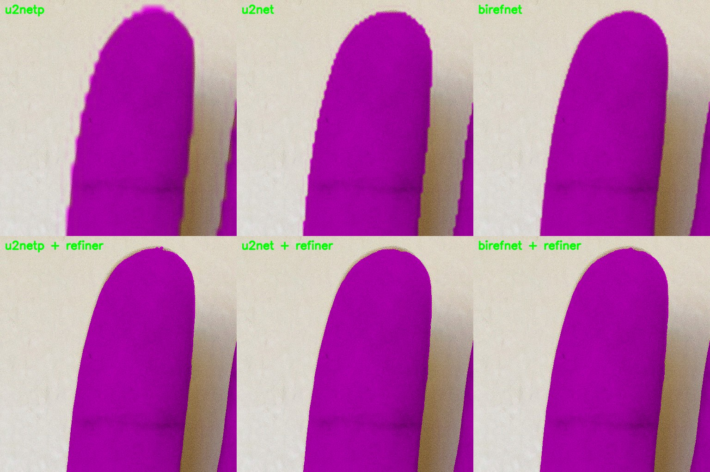
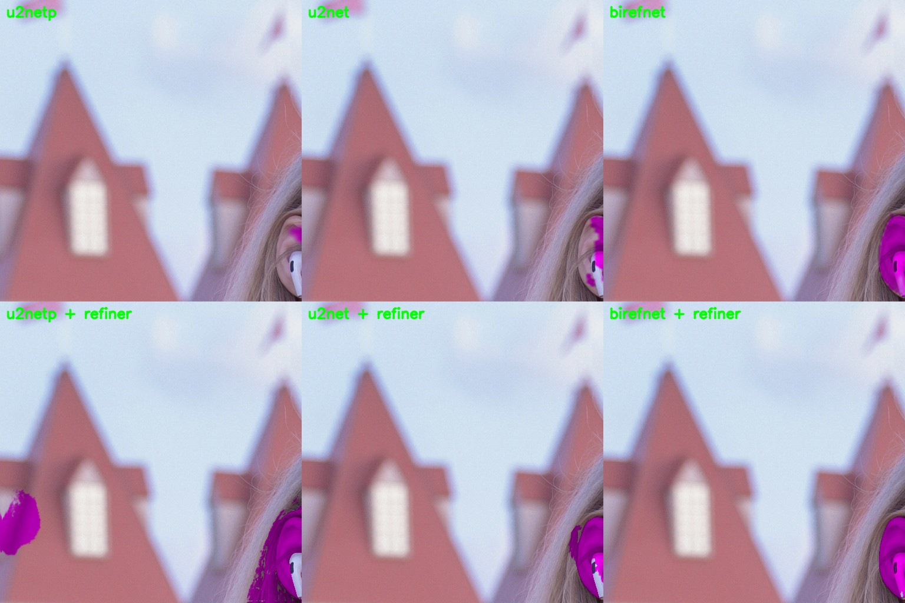
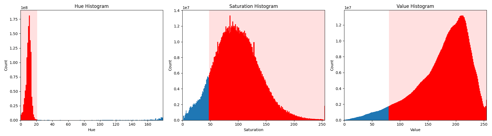
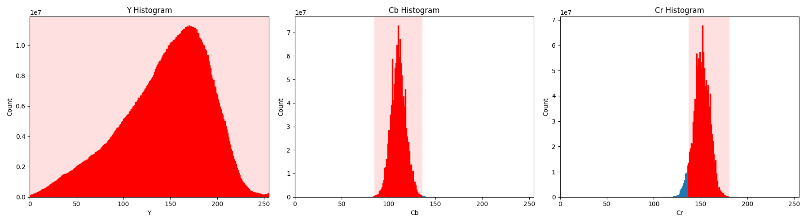
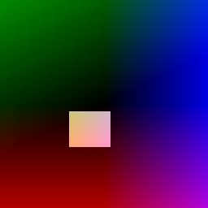
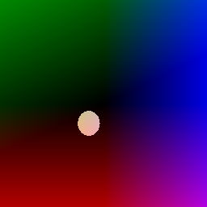
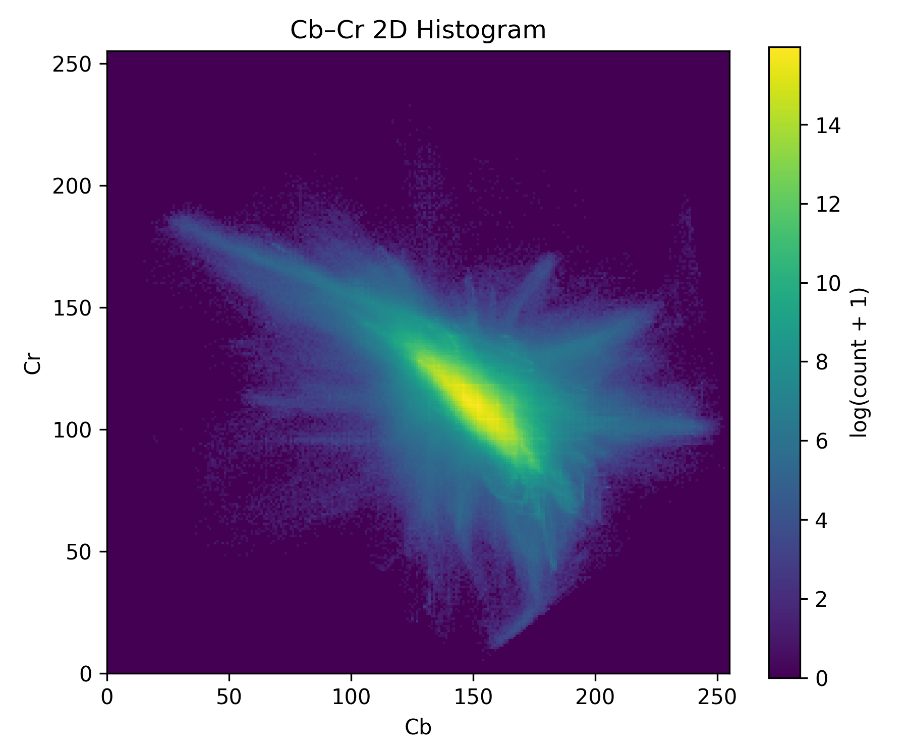
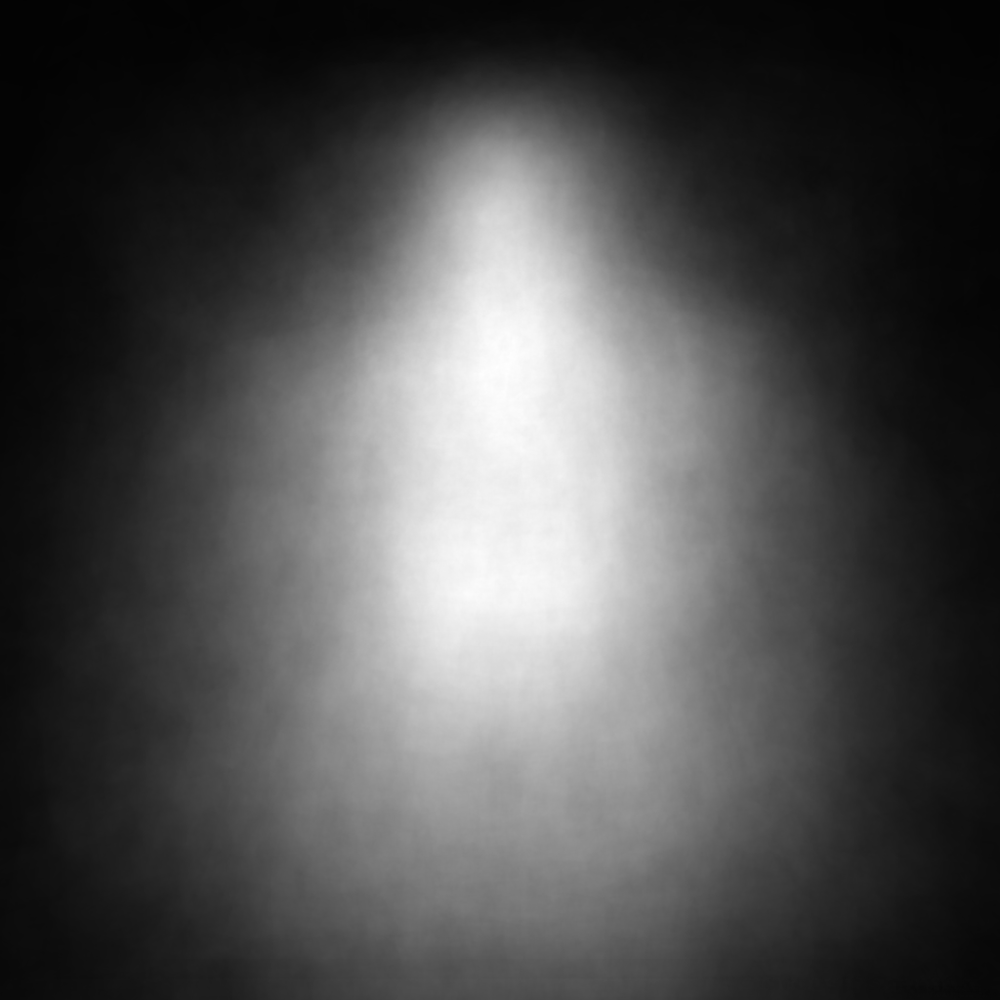
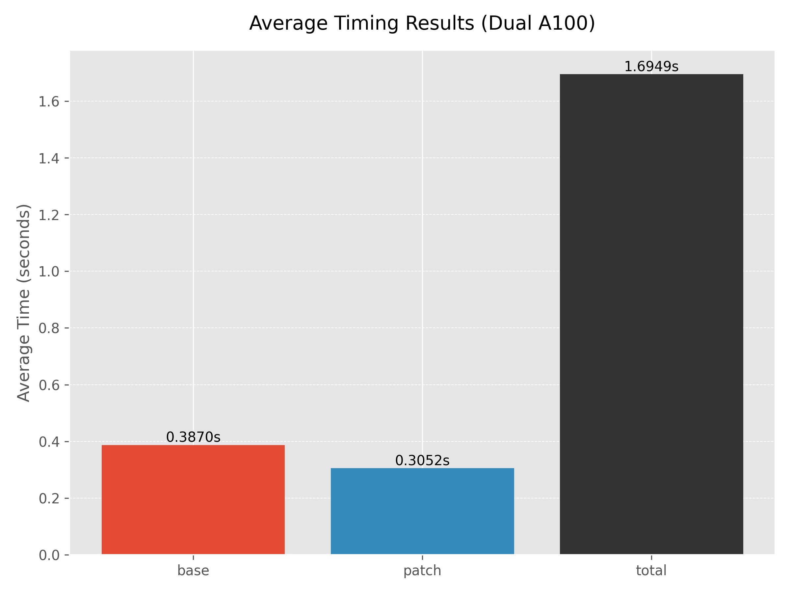
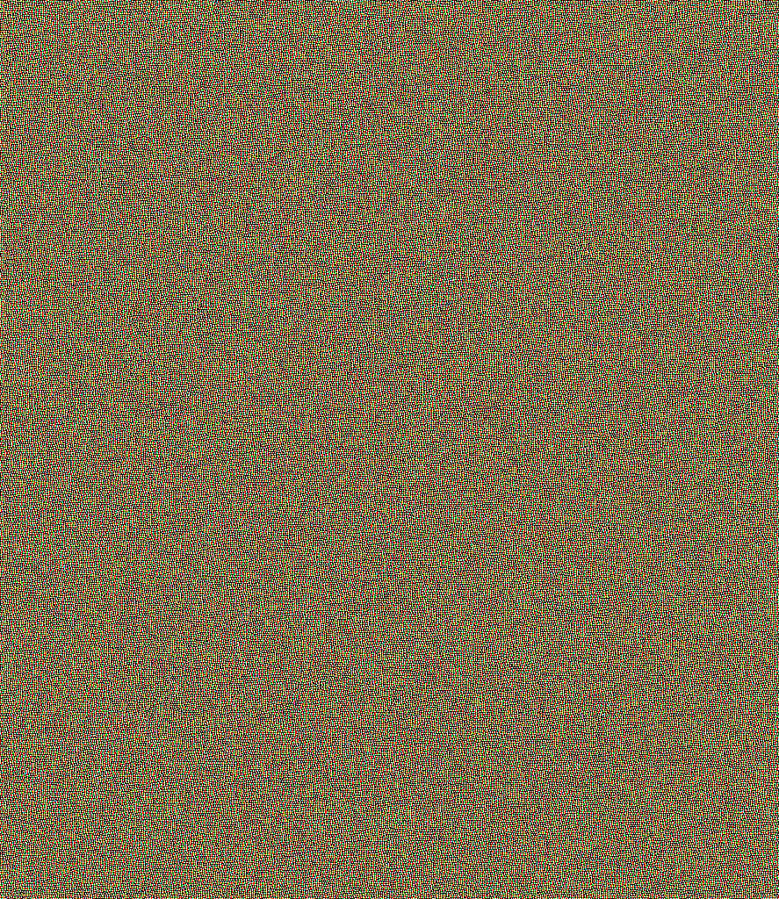

# Skin Segmentation

This repository details the various methods I have attempted for skin segmentation.

Currently, this more accurately called skin *region* segmentation as things like eyebrows, 
teeth, and eyes are included in the mask.

## Usage

For U<sup>2</sup>Net, U<sup>2</sup>NetP (including chunks), and DLMV models, 
you can use the `Session` class in [`u2net/session.py`](./u2net/session.py) for ONNX Runtime inference.
[`u2net/u2net_attempt.py`](./u2net/u2net_attempt.py) demonstrates the usage of this class. 

The BiRefNetSession class in [`birefnet/session.py`](./birefnet/session.py) can be used for ONNX 
inference of BiRefNet. 
Each folder further contains PyTorch session implementations.

An example of chunked refinement inference can be found in [`chunks/chunked_u2net.py`](./chunks/chunked_u2net.py).

Trying to figure out which model to use?
Try looking at [Metrics](#metrics) and [Inference Time](#inference-time) and choose 
the most accurate model within your computing environment's budget.

### Some Potential Use Cases

- Photomanipulation involving the correction of aspects of the skin such as pimples.

  - Demo: [`examples/inpaint_demo.mp4`](./examples/inpaint_demo.mp4)

- Hair segmentation, when combined with a human segmentation or SOD model and a human-in-the-loop (HITL) to remove the segmented clothes' region.

    - This can be done rather simply with [saturated subtraction](https://en.wikipedia.org/wiki/Saturation_arithmetic) of the masks as (human - skin).

      - This is available in the mathematics methods of OpenCV (cv2/opencv-python) 
        or by using specific SIMD instructions in your targeted ISA.

    - Alternatively, cloth(es) segmentation models exist. 
      Their outputs can be used with saturated subtraction as well.

- Gesture recognition and human-computer interaction

    - It can help identify regions-of-interest (ROI) for other systems to interpret.

- Content filtering based on how much skin is exposed

    - There are better ways to do this, but it is a *potential* use case.

- Face detection and tracking

    - The area of the skin mask with the most local variation likely includes facial features.

## Traditional

There are three methods in this folder that are doing roughly the same thing.

The first is in [hsv_range.py](traditional/hsv_range.py). 
This gives the user an interface to adjust various thresholds to make a more 
accurate mask of the skin in an image.

The second is in [face_skin.py](traditional/face_skin.py). 
It detects the face in an image and automatically adjusts the HSV thresholds based 
upon the data in that area.

Third is in [ycbcr_method](./traditional/ycbcr_method.py).
It effectively works the same as the HSV method (if automated), but in the YCbCr color space.

None of these methods were accurate enough for me. 
They are good if you need something fast and possibly in the ballpark. 
I even attempted to use both HSV color ranges and YCbCr ranges to no avail. 
Therefore, I went searching for AI methods and found [Google](#google)'s implementation.

### Other Traditional Methods

Since I seem to not be able to leave well enough alone, I've kept going with implementing traditional methods.

One such method is ICM ([icm_segment.py](./traditional/icm_segment.py)), which uses Markov random fields and locally conditional modes (ICM) to segment skin, 
roughly based on these two papers: [Pose-Invariant Face Recognition Using Markov Random Fields](https://ieeexplore.ieee.org/abstract/document/6378453?casa_token=0LIf6xnENO8AAAAA:H6wub7bacP3aGfgyVjFCJBMYNtWr4mhcQuJknShuioBtx_Yt0eRjTcle7kTk9u9YygmkexUsWA) and [Face detection based on improved skin model and local iterated conditional modes](https://ieeexplore.ieee.org/abstract/document/7378122?casa_token=AqK4dOQawBgAAAAA:8VsF0CyaNvlCKtOgL8ZLgfSyZCUkdejyQz_wfc5NK-Ptd2yu3-6-BfXL-W3DVsD2loOG2xkFmQ).
I'm including these here mostly for references as I did not directly use them for the included implementation.
This is supposedly the best *traditional* method for skin segmentation when you only look at skin pixels (not skin region).
This does not necessarily mean it is the best for skin *region* segmentation, though the skin region is mostly exclusively skin pixels.
Additionally, the time taken by this method is slower than the faster AI methods discussed later on CPU,
taking an average of 10.70s per image (at full resolution) with the default parameters and JIT compilation.

Next are the two elliptical YCbCr methods found at [elliptical_ycbcr.py](./traditional/elliptical_ycbcr.py) and [diagonal_elliptical_ycbcr.py](traditional/diagonal_elliptical_ycbcr.py).
These two methods are nearly identical, though with the diagonal variant using the formula for a diagonal ellipse.
Additionally, the diagonal variant uses parameters fit on the training dataset's distribution. 
If you want to see some of the fancy math around it, you can read the paper [Skin Color Modeling of Digital Photographic Images](https://library.imaging.org/admin/apis/public/api/ist/website/downloadArticle/jist/55/3/art00003).
It demonstrates segmentation with a diagonal ellipse using 2 color components, and with a brightness component.
The included diagonal implementation does not use the luminance of a particular pixel, but still performs fairly well.
Specifically, the diagonal method performs on-par with the ICM method, which was tuned on the same data, but utilizing much less compute.

## Google

This is a very basic implementation of skin segmentation utilizing Google's MediaPipe model. 
A list of models can be found [here](https://ai.google.dev/edge/mediapipe/solutions/vision/image_segmenter#multiclass-model), but I used the Selfie segmentation model. 

It worked ok when it did work. 
Often, the prediction would have extremely low confidence across an entire image. 

Therefore, I decided to pursue making a model of my own.

## U<sup>2</sup>-Net

As a preface, I did not originally start with this model architecture. 
I originally planned on making my own, but failed in a lot of different ways. 
Let's just say I know a few architectures that will take 12 GB of VRAM to train 
at a batch size of 1 and produce almost artistic representations of the input data. 

So, after weeks of research, I settled on the [U<sup>2</sup>-Net](https://github.com/xuebinqin/U-2-Net) architecture ([paper](https://arxiv.org/pdf/2005.09007)). 
I recommend checking out the original repo, plus the paper is a good read. 
It seemed to perform well in [rembg](https://github.com/danielgatis/rembg) with the added benefit of inferencing code (to an extent). 

Off I set to create a dataset of training images. 
It took a few weeks, maybe a month, but I had my dataset. 
I used [rembg-trainer](https://github.com/Jonathunky/rembg-trainer) initially, 
but my limited compute meant the code did not work well on my system. 
Lots of changes later and I had functioning code, a dataset, and a GPU to train it on. 
My CUDA optimizations can be found [here](https://github.com/samhaswon/rembg-trainer-cuda) if you wish to train your own model. 

A few weeks of figuring out training further and I ended up with a few models. 
They are refined to 512x512 (U<sup>2</sup>-Netp) and 1024x1024 (U<sup>2</sup>-Net). 
Probably the best to use of these is the 512x512 model, 
as it is a good balance of memory and the fit of the model while also being fast for CPU inferencing. 

Each model can be found in the [`Releases`](https://github.com/samhaswon/skin_segmentation/releases) tab in GitHub.

## DeepLabV3 + MobileNetV3 Backbone (DLMV)

This model was requested and does [ok](#metrics) for this task. 
It is not good enough for image editing, but could be used for close to real-time inference with this task.
It's better than the Google model I tested for this, but that's not saying much.

The `Session` class in [`./u2net/session.py`](./u2net/session.py) can also be used for this model.

## BiRefNet

I came across [BiRefNet](https://github.com/ZhengPeng7/BiRefNet) while trying to find something else ([paper](https://arxiv.org/pdf/2401.03407)). 
It's a good model, but incredibly difficult to work with from a memory perspective.
Needless to say, I learned some new techniques to even train the "lite" variant for skin segmentation.
I couldn't fit half of the model (at 1728x1728) on my RTX 3060, 
so it took some creative programming to split it while maintaining some measure of training speed.

Inference is a bit of a different story, with PyTorch only using something like 6GB of memory/VRAM.
However, as a word of warning, the ONNX version can take ~**40GB** of memory for some reason. 
Depending on how much you value inference speed, you may consider this tradeoff worth it.

In my testing, it is the new SOTA for this task, though by a limited margin. 
It's getting to the point of measuring how well the model follows my own variance, 
rather than purely how usable a particular model is for the task.
I try to stay consistent as I've made the dataset for this, 
but this model is really showing how nondeterministic I am as a human.
I would estimate that there's about 0.5-1% average variation in exactly what value is given for a particular pixel,
mostly from me dealing with JPG compression artifacting in the images.

Then there's the really difficult part of skin segmentation: translucent occlusion. 
This is where BiRefNet pulls ahead of the other models as it is better at handling something translucent partially obscuring skin.
This is just difficult to deal with, but BiRefNet handles it fairly well. 
As of writing this, there is one instance of translucent occlusion in the evaluation set 
that dramatically decreases the mIoU of most models and methods except 
HSV + YCbCr, Elliptical YCbCr, and ICM.
HSV + YCbCr and ICM actually went up in mIoU and Elliptical YCbCr decreased slightly.

## StraightU<sup>2</sup>Net

This came about from me asking "what happens when you take U<sup>2</sup>-Net and remove the 'U' part?"
Turns out, as-is, that's not the best idea and doesn't give good results.
However, I haven't been normalizing inputs this whole time beyond dividing by 255 for FP32.
Doing so, but centering on the skin region of the color space, this model does oddly well for its size.
I mostly tuned the parameters such that the compute is close to DLMV, giving ~80k parameters.

After results started getting good, the idea was to do better than the traditional methods and maybe DLMV.
It has turned out to be between DLMV and U<sup>2</sup>-NetP for the training and evaluation sets.
Notably, due to the method used to make it work well, it did not use the [color-based augmentations](#dataset-augmentation)
used to make the larger models better.
Additionally, the qualitative performance of this model is similar to DLMV in that more "odd" images
tend to do worse than easier images.
Because it works similar to the traditional methods, it also fails similarly.
It also succeeds weirdly, as we'll see later on.

## U<sup>2</sup>-Net (Chunks)

I did this for another project and because my dataset is high enough in resolution that most of the work was otherwise wasted. 
So why not push inference to resolutions you wouldn't otherwise see, with up to 50MP in training.

## Examples


As you can see, it's not perfect. 
But it's rather usable. 
The 512x512 U<sup>2</sup>NetP model tends to not be confident about things that are not skin, 
so it produces more accurate but less precise results than U<sup>2</sup>Net at times. 
However, some things like the book in one of the examples invert this tendency.
For all models, groups are an issue as they are not prevalent in the dataset.

It's not shown particularly well in this set of examples, 
but BiRefNet mostly does better with edges and areas of the image requiring more context.
This comes into play most with images with significant areas where the subject is occluded or otherwise obscured.
The fishnets example is there for this reason as that used to confuse all the models for that entire region.
New [augmentations](#dataset-augmentation) have helped with this.
Turns out, instead of dealing with doing them by hand, it's fairly effective to do it programmatically.

And to show what the models do when there is no skin in the image, there's the cheeseburger.
In the past, the models would classify random parts of the bun as "skin," 
but dataset volume and augmentations seem to have reduced that effect 
and introduced new model-specific idiosyncrasies.
The weirdest of which being StraightU<sup>2</sup>-Net (`sunet`), 
specifically because it's the only model that actually segmented this image correctly.

### Chunk Refinement

Making the refiner model for chunks/patches made for quite the improvement. 
When it works well, it's basically perfect. 
When it doesn't, it's not much of a help to the base model.




## Dataset Information

The dataset used in this project consists of 1,215 images (1,134 training) with a combined 
total of approximately 6.92×10⁹ labeled pixels (5.81×10⁹ training). 
Images were sourced from a variety of online 
(e.g., Google Image search results, Instagram) and private 
(e.g., my photography work, diffusion models) collections to maximize diversity of scene, 
lighting, and skin appearance.

A small portion of the dataset includes AI-generated images
to increase coverage of underrepresented skin tones and body types,
but the majority of images are real-world photographs.
All images were manually labeled for skin regions, 
with extra attention to challenging boundaries.
In low-contrast cases, manual adjustments to brightness and contrast were 
used to facilitate more accurate annotation, 
though these adjustments are not present in the dataset itself.

Due to privacy and copyright concerns, 
the full dataset will not be made publicly available. 
Aggregate statistics, summary figures, 
and select non-sensitive samples are shared for illustration purposes.
In the future, I may filter through the dataset to create a releasable version,
but as it stands, I do not have the time to do so.

### Figures

#### HSV Histograms:



Hue makes a relatively clear distinction between skin and not. 
However, saturation and value are spread out into more of a bell curve. 
It is this that distinguishes AI models from the traditional methods: 
they consider more than the values of a pixel.
Instead, they can incorporate more context into their prediction.

Red is used here to visualize the range of values used by the HSV method. 
Clearly, the entire range of values of what is skin is used by the method. 
This is part of the reason for the relatively poor performance of this method.
However, due to the nature of the data and the trends therein, inclusion of more of each range yields **worse** performance.

#### YCbCr Histograms:



Red is once again used here to visualize the range of values used by the *thresholding* YCbCr method.
In the case of YCbCr, this repository demonstrates two methods: thresholding and elliptical.
As elliptical segmentation requires both Cb and Cr, 
it cannot be easily visualized in this type of histogram.

Separating the color into two components, as YCbCr does, gives slightly more data that is useful for skin segmentation.
One notable thing the traditional YCbCr method does, at least in my implementation, is that it uses all luma (luminance) values.
This is because how bright a particular pixel is does not help to distinguish between skin and not skin, 
especially dependent upon the lighting of the image.




Now, let's take a slightly different look at the two color spaces. 
Above are two images representing the part of the YCbCr color space considered skin by the two methods,
with the luminance component (Y') set to 192 for positives and 0 for negatives.
The box-shaped one is the simple threshold and the rounded one is the elliptical method.
Both perform nearly the best for the traditional methods by incorporating only the important color information for the task.
Additionally, both skew towards red like the HSV method.



Next, let's look at a histogram of the values of both Cb and Cr in the dataset.
As you can see, there is a clear elliptical-ish shape near the middle.
Around that is a less frequent area in an odd pattern that kind of looks like a fighter jet to me.
Alternatively, you could view this as a terrain map for a single mountain on a flat plane.

Considering this with CbCr planes from earlier, 
we see how skin tends to be composed of red and yellow leaning colors, 
along with a mix of others due to lighting conditions.
If you recall from you childhood art classes, red and yellow make orange.
And when you take orange and reduce its luminance, you get brown.
Skew red for a more pinkish skin tone, 
subtracting blue chroma (adding green) to get more of a yellowish skin tone (red + green = yellow in additive color).

#### Heatmap



Viewing the masks as a heatmap, you can somewhat see the rule of thirds coming into play.
Roughly around what would be the center third is where the subject most frequently is, 
so that's where skin tends to appear.
Additionally, portrait shots and clothes skew the distribution spatially upwards,
with exposed arms and other areas making the distribution around that area somewhat smooth.

When generating the heatmap, it was normalized and not just averaged.
This makes the high points more obvious and less dulled from infrequency.
The dataset contains a rather diverse range of contexts, 
so the impact of portrait shots is not enough to be as noticeable without normalization.

### Dataset Augmentation

To improve model robustness and generalization, 
the dataset was extensively augmented using a range of color-based 
transformations. 
The augmentation pipeline was implemented in Python using OpenCV, 
applying a diverse set of pixel-level and global modifications. 
Each augmentation operation is designed to simulate real-world 
variations in lighting, color balance, and scene conditions that the 
model might encounter. 
These augmentations primarily come from [this](https://openaccess.thecvf.com/content/CVPR2022W/FaDE-TCV/papers/Xu_Color_Invariant_Skin_Segmentation_CVPRW_2022_paper.pdf) paper.

Augmentation steps include:

- **Hue rotation**: Systematically shifts the hue channel, 
  generating multiple color variants of the same image. 
  This helps the model cope with unusual lighting and environments 
  that shift skin tone appearance.

- **Desaturation**: Produces grayscale and desaturated variants, 
  training the model to identify skin even when color cues are 
  unreliable.

- **Contrast and brightness adjustments**: Alters both the contrast and 
  brightness across a range of settings,
  exposing the model to low-contrast situations (which are a known 
  failure mode) and high-dynamic-range scenes.

- **Sepia filtering**: Applies varying degrees of sepia toning, 
  mimicking the look of old or filtered photographs, which can alter 
  apparent skin color and contrast.

    - My implementation technically swaps blue and red, so it is more bluish than yellowed.

- **Subject occlusion**: A regular lattice pattern is generated, 
  then randomly rotated within a 0-90° range. 
  This rotated lattice is superimposed on the subject within the image, partially obscuring them. 
  The approach simulates realistic visual obstructions while preserving background and contextual 
  cues, forcing models to learn more robust representations under opaque occlusion. 
  Another lattice is also partially applied to the subject area by some amount.
  Locally, this simulates things like bracelets, watches, and other jewelry the 
  models struggled with in the past.

For every original image, each augmentation is saved as a new sample 
with its corresponding mask, maintaining one-to-one image-label alignment. 
The [augmentation script](https://github.com/samhaswon/rembg-trainer-cuda/blob/master/augment.py) 
produces a total of 26 different augmented images per original input, 
greatly increasing the diversity and size of the training set.

This augmentation strategy is particularly important given the dataset's 
real-world diversity and the fact that segmentation quality suffers 
most in low-contrast or visually ambiguous scenes. 
By systematically varying hue, saturation, contrast, and color cast, 
the model is encouraged to learn a representation of "skin"
that is less dependent on specific lighting or camera settings, 
and more resilient to challenging cases.
However, this is only used for training and not evaluation.

## Quantitative Results

### Parameters and FLOPs

FLOP count analysis was done with `fvcore`.
Google (MediaPipe) is omitted due to its backend which I do not wish to learn.
Do note that this process is imperfect, with some unsupported operators in each model. 
BiRefNet has the most, with the CNN-based models having only a few like sigmoid.
Additionally, BiRefNet (BiRefNet_lite) was not trained at 2048x2048 due to VRAM constraints.

|           Model           | Inference Size | GFLOPS  |   Params   |
|:-------------------------:|:--------------:|:-------:|:----------:|
|       BiRefNet_lite       |      2048      | 931.572 | 44,313,720 |
|       BiRefNet_lite       |      1728      | 658.997 | 44,313,720 |
|       BiRefNet_lite       |      1440      | 459.547 | 44,313,720 |
|     U<sup>2</sup>Net      |      1024      | 604.007 | 44,009,869 |
|     U<sup>2</sup>NetP     |      1024      | 205.082 | 1,131,181  |
|     U<sup>2</sup>NetP     |      512       | 51.271  | 1,131,181  |
| StraightU<sup>2</sup>Net  |      320       |  8.294  |   79,937   |
|   DeepLabV3MobileNetV3    |      256       |  2.473  | 11,020,337 |

### Metrics

Mean Intersection over Union (mIoU) is used to evaluate the 
classification performance of each model and method tested.
A perfect score would be 1.0, but that is unlikely even for a human.
It is calculated with:
```py
intersection = np.bitwise_and(prediction, ground_truth).sum()
union = np.bitwise_or(prediction, ground_truth).sum()
iou = intersection / union
```
And the mean is taken across images.

mIoU@ is calculated slightly differently, namely by first binarizing the inputs.
This does lead to an increase in accuracy, mostly from the ground truth being binarized.
```py
prediction = torch.tensor(prediction, dtype=torch.float32) / 255.0
labels = torch.tensor(labels, dtype=torch.float32) / 255.0
bin_pred = (prediction >= at).float()
bin_lab = labels.round()
inter = (bin_pred * bin_lab).sum(dim=(0, 1))
union = bin_pred.sum(dim=(0, 1)) + bin_lab.sum(dim=(0, 1)) - inter
iou_v = ((inter + 1e-6) / (union + 1e-6)).mean().item()
```

Another metric used is Mean Absolute Error (MAE). 
Effectively, it's a measure of how wrong the model or method is on average.
This calculation is done pixel-wise over the dataset, but the maximum it can be is 255.

Next is Human Correction Efforts (HCE) from the [Dichotomous Image Segmentation paper](https://arxiv.org/pdf/2203.03041).
In short, it's a way to approximate the number of mouse click operations required to correct the false positives and false negatives.
The code used comes from the original repo [here](https://github.com/xuebinqin/DIS/tree/main).
If you end up using it for something, it is rather slow to calculate.

#### Training Set

| Model/Method              | mIoU       | mIoU@0.5   | MAE         | HCE    |
|:--------------------------|:-----------|:-----------|:------------|:-------|
| BiRefNet                  | 0.97259184 | 0.98543735 | 0.65279536  | 100.6  |
| U<sup>2</sup>Net          | 0.95717705 | 0.97403675 | 2.21020127  | 99.0   |
| U<sup>2</sup>NetP         | 0.92909448 | 0.94376292 | 3.53340132  | 131.6  |
| StraightU<sup>2</sup>Net  | 0.86673576 | 0.88170478 | 5.83840019  | 177.9  |
| DeepLabV3MobileNetV3      | 0.87064232 | 0.88061131 | 4.80666945  | 119.4  |
| Google (MediaPipe)        | 0.61916837 | 0.61970152 | 31.84890669 | 237.1  |
| ICM                       | 0.63464635 | 0.63695261 | 29.26669075 | 834.1  |
| Diagonal Elliptical YCbCr | 0.62804600 | 0.63014882 | 33.72749032 | 934.4  |
| Elliptical YCbCr          | 0.52903351 | 0.53050420 | 39.72920897 | 908.2  |
| YCbCr                     | 0.54825962 | 0.54968896 | 51.89878261 | 787.7  |
| YCbCr & HSV               | 0.54879407 | 0.55008863 | 41.10210647 | 1119.8 |
| HSV                       | 0.52135957 | 0.52343017 | 46.99411327 | 1176.1 |
| Face                      | 0.36567424 | 0.36688121 | 67.68717940 | 1367.4 |

Time: 89343.20s (~24.8 hours)

#### Evaluation Set

| Model/Method              | mIoU       | mIoU@0.5   | MAE         | HCE    |
|:--------------------------|:-----------|:-----------|:------------|:-------|
| BiRefNet                  | 0.94676485 | 0.96104952 | 1.19378242  | 243.0  |
| U<sup>2</sup>Net          | 0.91045846 | 0.92545818 | 1.89087316  | 357.4  |
| U<sup>2</sup>NetP         | 0.81010457 | 0.82169437 | 7.78251227  | 404.5  |
| StraightU<sup>2</sup>Net  | 0.81241271 | 0.82753460 | 5.02443159  | 426.7  |
| DeepLabV3MobileNetV3      | 0.63919717 | 0.64474565 | 14.72501576 | 250.1  |
| Google (MediaPipe)        | 0.53910064 | 0.54039942 | 34.66313170 | 588.1  |
| ICM                       | 0.61323843 | 0.61692257 | 35.90004491 | 1812.6 |
| Diagonal Elliptical YCbCr | 0.60055915 | 0.60407782 | 40.97930589 | 2173.1 |
| Elliptical YCbCr          | 0.50804118 | 0.51063570 | 35.44894022 | 1834.5 |
| YCbCr                     | 0.51649743 | 0.51923974 | 55.07992628 | 1918.7 |
| YCbCr & HSV               | 0.54996273 | 0.55275393 | 37.92072090 | 2116.1 |
| HSV                       | 0.52790392 | 0.53102479 | 42.32860969 | 2254.4 |
| Face                      | 0.34798417 | 0.35025993 | 72.99048409 | 3051.5 |

Time: 11442.24s

Note: the traditional methods do not include part of the eyes and the lips, 
so that is part of the worse performance you see here.
Additionally, BiRefNet in FP32 takes ~14GB of memory with PyTorch, but ~40GB with onnxruntime at 1728x1728.

#### Quantized Results (QAT)

##### Training Set

| Model                | Quantization Engine | mIoU       | mIoU@0.5   | MAE        | HCE   |
|:---------------------|:--------------------|:-----------|:-----------|:-----------|:------|
| U<sup>2</sup>Net     | fbgemm (x86)        | 0.95669021 | 0.97555741 | 1.27610285 | 98.5  |
| U<sup>2</sup>Net     | qnnpack             | 0.95695430 | 0.97582812 | 1.35306197 | 97.9  |
| U<sup>2</sup>NetP    | fbgemm (x86)        | 0.93432550 | 0.95050526 | 2.12303022 | 120.5 |
| U<sup>2</sup>NetP    | qnnpack             | 0.93109669 | 0.95057666 | 2.33878247 | 120.2 |
| DeepLabV3MobileNetV3 | fbgemm (x86)        | 0.85428560 | 0.86595966 | 5.53276895 | 164.7 |
| DeepLabV3MobileNetV3 | qnnpack             | 0.85433149 | 0.86604015 | 5.53080864 | 165.1 |

Time: 32394.77s

##### Evaluation Set

| Model                | Quantization Engine | mIoU       | mIoU@0.5   | MAE         | HCE   |
|:---------------------|:--------------------|:-----------|:-----------|:------------|:------|
| U<sup>2</sup>Net     | fbgemm (x86)        | 0.90129324 | 0.91815587 | 2.29222730  | 357.6 |
| U<sup>2</sup>Net     | qnnpack             | 0.90402319 | 0.92131388 | 2.40288605  | 354.9 |
| U<sup>2</sup>NetP    | fbgemm (x86)        | 0.83576632 | 0.84978227 | 4.43336496  | 400.6 |
| U<sup>2</sup>NetP    | qnnpack             | 0.82966553 | 0.84633177 | 4.80103991  | 398.7 |
| DeepLabV3MobileNetV3 | fbgemm (x86)        | 0.63009295 | 0.63640658 | 14.55390057 | 430.8 |
| DeepLabV3MobileNetV3 | qnnpack             | 0.62928274 | 0.63572706 | 14.70489649 | 430.7 |

Time: 4684.89s

#### Chunked Inference

(evaluation set)

|    Base Model     | mIoU | mIoU@0.5 | MAE | HCE |
|:-----------------:|:-----|:---------|:----|:----|
|     BirefNet      |      |          |     |     |
| U<sup>2</sup>Net  |      |          |     |     |
| U<sup>2</sup>NetP |      |          |     |     |

### Inference Time

These results are from (mostly) CPU inferencing on a Ryzen 7 4800H with an Nvidia GTX 1650TI for CUDA running Ubuntu 24.04.
They are intended to showcase relative performance and not the exact results you should expect. 
No particular tuning was done to optimize performance other than what is stated.
Furthermore, these tests are for speed and not model accuracy. 
U<sup>2</sup>Net is still going to do best with 1024x1024 inputs, 
U<sup>2</sup>NetP with 512x512, and DeepLabV3MobileNetV3 with 256x256,
though either U<sup>2</sup>Net or U<sup>2</sup>NetP may do well with the next lowest resolution.

Some of these results are, admittedly, confusing considering that what should decrease inference time 
increases it in some cases.
Also, onnxruntime is very much a time-memory tradeoff decision.
While it is faster, it may use too much memory depending on the intended application.
Additionally, the torch compile mode is `max-autotune-no-cudagraphs` and took a while to do, 
though this is not included in the average time reported.
Finally, this does not include pre- or post-processing of inputs and outputs.
Except for BiRefNet, which is special, they're all identical in that regard anyway.

Additionally, some of the BiRefNet tests in PyTorch just got stuck. 
I got bored with waiting on it to do anything after hours, so there are no results for those tests.

| Model                                                        | 256x256 | 320x320 | 512x512 | 1024x1024 | 1280x1280 | 1728x1728 | 2048x2048 |
|:-------------------------------------------------------------|:--------|:--------|:--------|:----------|:----------|:----------|:----------|
| BiRefNet(\_lite) (torch)                                     | 0.6290s | 0.9046s | 2.6359s | 12.5315s  | 15.6293s  | 27.5822s  | 62.9691s  |
| BiRefNet(\_lite) (torch, `inference_mode`)                   | 0.5694s | 0.8162s | 2.3019s | 10.7903s  | <hr>      | <hr>      | <hr>      |
| BiRefNet(\_lite) (`torch.compile`)                           | 0.5058s | 0.8064s | 2.1033s | 10.7870s  | <hr>      | <hr>      | <hr>      |
| BiRefNet(\_lite) (onnxruntime)                               | <hr>    | <hr>    | <hr>    | <hr>      | <hr>      | 18.8971s  | <hr>      |
| U<sup>2</sup>Net (torch)                                     | 0.3108s | 0.4828s | 1.2603s | 5.5562s   | 9.0918s   | 14.7011s  | 21.2722s  |
| U<sup>2</sup>Net (torch, `inference_mode`)                   | 0.2896s | 0.4485s | 1.2012s | 5.3387s   | 8.4383s   | 15.6485s  | 21.8896s  |
| U<sup>2</sup>Net (`torch.compile`)                           | 0.2170s | 0.4269s | 1.2449s | 5.6484s   | 7.2809s   | 15.9674s  | 23.3404s  |
| U<sup>2</sup>Net (`torch.compile`, `inference_mode`)         | 0.2562s | 0.4363s | 1.3019s | 5.5165s   | 8.4393s   | 16.4477s  | 24.1659s  |
| U<sup>2</sup>Net (onnxruntime)                               | <hr>    | <hr>    | <hr>    | 3.0919s   | <hr>      | <hr>      | <hr>      |
| U<sup>2</sup>Net (onnxruntime qnnpack)                       | <hr>    | <hr>    | <hr>    | 2.9634s   | <hr>      | <hr>      | <hr>      |
| U<sup>2</sup>Net (onnxruntime fbgemm)                        | <hr>    | <hr>    | <hr>    | 2.9522s   | <hr>      | <hr>      | <hr>      |
| U<sup>2</sup>Net (torch + CUDA)                              | <hr>    | <hr>    | <hr>    | 0.4711s   | <hr>      | <hr>      | <hr>      |
| U<sup>2</sup>NetP (torch)                                    | 0.1559s | 0.2331s | 0.7607s | 3.1737s   | 4.7568s   | 8.6204s   | 12.4256s  |
| U<sup>2</sup>NetP (torch, `inference_mode`)                  | 0.1289s | 0.2248s | 0.7545s | 3.1868s   | 4.9511s   | 9.0723s   | 13.2336s  |
| U<sup>2</sup>NetP (`torch.compile`)                          | 0.0986s | 0.2029s | 0.6119s | 2.5031s   | 3.4430s   | 6.9755s   | 9.6092s   |
| U<sup>2</sup>NetP (`torch.compile`, `inference_mode`)        | 0.0796  | 0.1683s | 0.5701s | 2.3462s   | 3.8350s   | 6.9258s   | 9.9064s   |
| U<sup>2</sup>NetP (onnxruntime)                              | <hr>    | <hr>    | 0.3396s | <hr>      | <hr>      | <hr>      | <hr>      |
| U<sup>2</sup>NetP (onnxruntime qnnpack)                      | <hr>    | <hr>    | 0.4229s | <hr>      | <hr>      | <hr>      | <hr>      |
| U<sup>2</sup>NetP (onnxruntime fbgemm)                       | <hr>    | <hr>    | 0.4184s | <hr>      | <hr>      | <hr>      | <hr>      |
| U<sup>2</sup>NetP (torch + CUDA)                             | <hr>    | <hr>    | 0.0621s | <hr>      | <hr>      | <hr>      | <hr>      |
| StraightU<sup>2</sup>Net (torch)                             | 0.0741s | 0.1203s | 0.3765s | 1.9290s   | 3.0581s   | 5.6680s   | 7.7672s   |
| StraightU<sup>2</sup>Net (torch, `inference_mode`)           | 0.0347s | 0.0437s | 0.1567s | 0.7670s   | 1.1879s   | 2.2361s   | 3.0404s   |
| StraightU<sup>2</sup>Net (`torch.compile`)                   | 0.0636s | 0.1082s | 0.4289s | 2.0326s   | 3.1480s   | 5.6107s   | 7.8701s   |
| StraightU<sup>2</sup>Net (`torch.compile`, `inference_mode`) | 0.0353s | 0.0514s | 0.1529s | 0.8069s   | 1.2580s   | 2.2380s   | 3.1538s   |
| StraightU<sup>2</sup>Net (onnxruntime)                       | <hr>    | 0.0481s | <hr>    | <hr>      | <hr>      | <hr>      | <hr>      |
| DeepLabV3MobileNetV3 (torch)                                 | 0.0255s | 0.0374s | 0.0829s | 0.4163s   | 0.6279s   | 1.1827s   | 1.9184s   |
| DeepLabV3MobileNetV3 (torch, `inference_mode`)               | 0.0266s | 0.0375s | 0.0851s | 0.3943s   | 0.6804s   | 1.5489s   | 2.3601s   |
| DeepLabV3MobileNetV3 (`torch.compile`)                       | 0.0289s | 0.0328s | 0.0997s | 0.4766s   | 0.6788s   | 1.5522s   | 2.5041s   |
| DeepLabV3MobileNetV3 (`torch.compile`, `inference_mode`)     | 0.0292s | 0.0389s | 0.1125s | 0.5513s   | 0.7568s   | 1.5301s   | 2.5492s   | 
| DeepLabV3MobileNetV3 (onnxruntime)                           | 0.0120s | <hr>    | <hr>    | <hr>      | <hr>      | <hr>      | <hr>      |
| DeepLabV3MobileNetV3 (onnxruntime qnnpack)                   | 0.0134s | <hr>    | <hr>    | <hr>      | <hr>      | <hr>      | <hr>      |
| DeepLabV3MobileNetV3 (onnxruntime fbgemm)                    | 0.0139s | <hr>    | <hr>    | <hr>      | <hr>      | <hr>      | <hr>      |

#### Chunk Times

As a part of a related project, I got access to A100s to do some inference.
So, if you happen to be able to use dual A100s for chunk inference, this is what those numbers look like.
Mind you, this was after quite a lot of optimization.

The base model used was BiRefNet. In total, there were 72 chunks for the patch model to process.



## Qualitative Error Analysis

While the models achieve high mean IoU,
the primary source of failure is low-contrast boundaries between skin and background.
Annotating such images often required manual contrast and brightness adjustment even for a human labeler.
Typical errors include missed skin regions or false positives
when the color or texture of the background closely matches skin.
Blonde hair can also prove to be a similar difficulty, 
especially where it overlaps skin.
This limitation applies across all skin tones.

As an example, where does the background start here:


Other error sources are related to the limited spatial context available to CNNs.
For more ambiguous cases or where broader scene understanding is necessary,
transformer-based architectures offer a marginal improvement,
but gains are relatively small compared to the challenge posed by inherently ambiguous boundaries.

It is possible that larger transformer-based models can perform better (e.g., the larger BiRefNet models), 
but gains are likely to be small.
Excluding transparent occlusion, which is comparatively underrepresented, 
U<sup>2</sup>Net and BiRefNet perform somewhat comparably on this task both quantitatively and qualitatively.
Outside more difficult areas of an image, the difference between the two is primarily a matter of precision.

Some other troublesome areas:

- Translucent occlusion

- Airpods (apparently)

- Glasses

    - BiRefNet actually does ok on this given the frames are wide enough.

    - This has to do with both inference size and lenses, as some lenses and frames can be difficult to handle.

- Thin strands of hair, including facial hair.

- Groups 

    - This class of image is underrepresented in the dataset

- Images without skin as this is not trained for.

- Tattoos

    - These are somewhat hard to train well for as they can be a colored/dark random spot 
      in the skin area that appears as something which should not be considered skin.

- Sudden, deep shadows

    - More gradual ones generally do fine, but I guess sharply contrasting shadows look like occlusion.

- Skin-ish colored things occluding skin

    - For example, the leg of a wooden chair with a leg behind it.

Trouble areas for CNN-based models:

- Small, disconnected skin areas (e.g., a random hand, a thumb with the rest of the hand occluded)

Trouble areas for DeepLabV3 + MobileNetV3 (DLMV):

- Basically anything that isn't a simple headshot like you would see in a profile picture.

## Deep Dreaming

What happens when you take one of the skin segmentation models, U<sup>2</sup>-Net in this case, and run the Deep Dream algorithm on it?
Well, it looks something like this.
If you zoom out or blur the image, it averages out to a shade of brown.
This makes sense when you think about how the traditional methods work.
The most likely skin regions of an image are some shade of brown to white.


