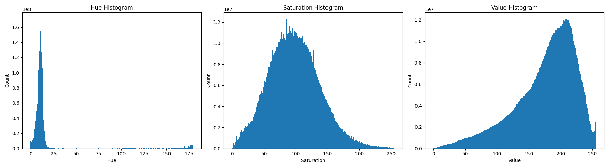

# Skin Segmentation

This repository details the various methods I have attempted for skin segmentation.

## Usage

For U<sup>2</sup>Net, U<sup>2</sup>NetP, and DLMV models, 
you can use the `Session` class in [`u2net/session.py`](./u2net/session.py) for ONNX Runtime inference.
[`u2net/u2net_attempt.py`](./u2net/u2net_attempt.py) demonstrates the usage of this class.

Trying to figure out which model to use?
Try looking at [mIoU](#miou) and [Inference Time](#inference-time) and choose 
the most accurate model within your computing environment.

## Traditional

There are two methods in this folder that are doing roughly the same thing.

The first is in [hsv_range.py](traditional/hsv_range.py). 
This gives the user an interface to adjust various thresholds to make a more 
accurate mask of the skin in an image.

The second is in [face_skin.py](traditional/face_skin.py). 
It detects the face in an image and automatically adjusts the thresholds based 
upon the data in that area.

Neither method was accurate enough for me. 
They are good if you need something fast and possibly in the ballpark. 
I even attempted to use both HSV color ranges and YCbCr ranges to no avail. 
Therefore, I went to the next part.

## Google

This is a very basic implementation of skin segmentation utilizing Google's MediaPipe model. 
A list of models can be found [here](https://developers.google.com/mediapipe/solutions/vision/image_segmenter#selfie-model), but I used the Selfie segmentation model. 

It worked ok when it did work. 
Often, the prediction would have extremely low confidence across an entire image. 

Therefore, I decided to pursue making a model of my own.

## U<sup>2</sup>-Net

As a preface, I did not originally start with this model architecture. 
I originally planned on making my own, but failed in a lot of different ways. 
Let's just say I know a few architectures that will take 12 GB of VRAM to train 
at a batch size of 1 and produce almost artistic representations of the input data. 

So, after weeks of research, I settled on the [U<sup>2</sup>-Net](https://github.com/xuebinqin/U-2-Net) architecture. 
I recommend checking out the original repo, plus the paper is a good read. 
It seemed to perform well in [rembg](https://github.com/danielgatis/rembg) with the added benefit of inferencing code (to an extent). 

Off I set to create a dataset of training images. 
It took a few weeks, maybe a month, but I had my dataset. 
I used [rembg-trainer](https://github.com/Jonathunky/rembg-trainer) initially, 
but my limited compute meant the code did not work well on my system. 
Lots of changes later and I had functioning code, a dataset, and a GPU to train it on. 

My CUDA optimizations can be found [here](https://github.com/samhaswon/rembg-trainer-cuda) if you wish to train your own model. 

A few weeks of figuring out training further and I ended up with a few models. 
They are refined to 512x512 (U<sup>2</sup>-Netp) and 1024x1024 (U<sup>2</sup>-Net). 
Probably the best to use of these is the 512x512 model, 
as it is a good balance of memory and the fit of the model while also being fast for CPU inferencing. 

Each model can be found in the [`Releases`](https://github.com/samhaswon/skin_segmentation/releases) tab in GitHub.

## DeepLabV3 + MobileNetV3 Backbone (DLMV)

This model was requested and does [ok](#mIoU) for this task. 
It is not good enough for image editing, but could be used for close to real-time inference with this task.
It's better than the Google model I tested for this, but that's not saying much.

The `Session` class in [`./u2net/session.py`](./u2net/session.py) can also be used for this model.

## Examples


As you can see, it's not perfect. 
But it's rather usable. 
The 512x512 U<sup>2</sup>NetP model tends to not be confident about things that are not skin, 
so it produces more accurate but less precise results than U<sup>2</sup>Net. 
For all models, groups are an issue as they are not prevalent in the dataset.

And to show what the models do when there is no skin in the image, there's the cheeseburger.
In the past, the models would classify random parts of the bun as "skin," 
but dataset volume and augmentations seem to have reduced that effect.

## Dataset Information

The dataset used in this project consists of 1,134 images with a combined 
total of approximately 5.86 × 10⁹ labeled pixels. 
Images were sourced from a variety of online 
(e.g., Google Image search results, Instagram) and private 
(e.g., my photography work) collections to maximize diversity of scene, 
lighting, and skin appearance.

A small portion of the dataset includes AI-generated images
to increase coverage of underrepresented skin tones and body types,
but the majority of images are real-world photographs.
All images were manually labeled for skin regions, 
with extra attention to challenging boundaries.
In low-contrast cases, manual adjustments to brightness and contrast were 
used to facilitate more accurate annotation, 
though these adjustments are not present in the dataset itself.

Due to privacy and copyright concerns, 
the full dataset will not be made publicly available. 
Aggregate statistics, summary figures, 
and select non-sensitive samples are shared for illustration purposes.

### Figures

HSV Histograms:



Hue makes a relatively clear distinction between skin and not. 
However, saturation and value are spread out into more of a bell curve. 
It is this that distinguishes AI models from the traditional methods: 
they consider more than the values of a pixel.
Instead, they can incorporate more context into their prediction.

### Dataset Augmentation

To improve model robustness and generalization, 
the dataset was extensively augmented using a range of color-based 
transformations. 
The augmentation pipeline was implemented in Python using OpenCV, 
applying a diverse set of pixel-level and global modifications. 
Each augmentation operation is designed to simulate real-world 
variations in lighting, color balance, and scene conditions that the 
model might encounter. 
These augmentations primarily come from [this](https://openaccess.thecvf.com/content/CVPR2022W/FaDE-TCV/papers/Xu_Color_Invariant_Skin_Segmentation_CVPRW_2022_paper.pdf) paper.

Augmentation steps include:

- **Hue rotation**: Systematically shifts the hue channel, 
  generating multiple color variants of the same image. 
  This helps the model cope with unusual lighting and environments 
  that shift skin tone appearance.

- **Desaturation**: Produces grayscale and desaturated variants, 
  training the model to identify skin even when color cues are 
  unreliable.

- **Contrast and brightness adjustments**: Alters both the contrast and 
  brightness across a range of settings,
  exposing the model to low-contrast situations (which are a known 
  failure mode) and high-dynamic-range scenes.

- **Sepia filtering**: Applies varying degrees of sepia toning, 
  mimicking the look of old or filtered photographs, which can alter 
  apparent skin color and contrast.
- **Subject occlusion**: A regular lattice pattern is generated, 
  then randomly rotated within a 0–90° range. 
  This rotated lattice is superimposed on the subject within the image, partially obscuring them. 
  The approach simulates realistic visual obstructions while preserving background and contextual 
  cues, forcing models to learn more robust representations under occlusion. 
  Another lattice is also partially applied to the subject area by some amount.
  Locally, this simulates things like bracelets, watches, and other jewelry the 
  models struggled with in the past.

For every original image, each augmentation is saved as a new sample 
with its corresponding mask, maintaining one-to-one image-label alignment. 
The [augmentation script](https://github.com/samhaswon/rembg-trainer-cuda/blob/master/augment.py) 
produces a total of 26 different augmented images per original input, 
greatly increasing the diversity and size of the training set.

This augmentation strategy is particularly important given the dataset's 
real-world diversity and the fact that segmentation quality suffers 
most in low-contrast or visually ambiguous scenes. 
By systematically varying hue, saturation, contrast, and color cast, 
the model is encouraged to learn a representation of "skin"
that is less dependent on specific lighting or camera settings, 
and more resilient to challenging cases.
However, this is only used for training and not evaluation.

## Quantitative Results

### Parameters and FLOPs

FLOP count analysis was done with `fvcore`.
Google (MediaPipe) is omitted due to its backend.

|        Model         | Inference Size | GFLOPS  |   Params   |
|:--------------------:|:--------------:|:-------:|:----------:|
|   U<sup>2</sup>Net   |      1024      | 604.007 | 44,009,869 |
|  U<sup>2</sup>NetP   |      1024      | 205.082 | 1,131,181  |
|  U<sup>2</sup>NetP   |      512       | 51.271  | 1,131,181  |
| DeepLabV3MobileNetV3 |      256       |  2.473  | 11,020,337 |

### mIoU

Mean Intersection over Union (mIoU) is used to evaluate the 
classification performance of each model and method tested.
It is calculated with:
```py
intersection = np.bitwise_and(prediction, ground_truth).sum()
union = np.bitwise_or(prediction, ground_truth).sum()
iou = intersection / union
```
And the mean is taken across images.

| Model/Method         | mIoU       |
|:---------------------|:-----------|
| U<sup>2</sup>Net     | 0.95706976 |
| U<sup>2</sup>NetP    | 0.92763412 |
| DeepLabV3MobileNetV3 | 0.86016590 |
| Google (MediaPipe)   | 0.62159355 |
| YCbCr                | 0.59500706 |
| YCbCr & HSV          | 0.54362017 |
| HSV                  | 0.53465931 |
| Face                 | 0.53284573 |

Note: the traditional methods do not include part of the eyes and the lips, 
so that is part of the worse performance you see here.

#### Quantized Results (QAT)

| Model                | Quantization Engine | mIoU         |
|:---------------------|:--------------------|:-------------|
| U<sup>2</sup>Net     | fbgemm (x86)        | 0.9582526028 |
| U<sup>2</sup>Net     | qnnpack             | 0.9585405395 |
| U<sup>2</sup>NetP    | fbgemm (x86)        | 0.9345262437 |
| U<sup>2</sup>NetP    | qnnpack             | 0.9311561166 |
| DeepLabV3MobileNetV3 | fbgemm (x86)        | 0.8624664545 |
| DeepLabV3MobileNetV3 | qnnpack             | 0.8623675622 |

### Inference Time

These results are from CPU inferencing on a Ryzen 7 4800H with an Nvidia GTX 1650TI for CUDA running Ubuntu 24.04.
They are intended to showcase relative performance and not the exact results you should expect. 
No particular tuning was done to optimize performance other than what is stated.
Furthermore, these tests are for speed and not model accuracy. 
U<sup>2</sup>Net is still going to do best with 1024x1024 inputs, 
U<sup>2</sup>NetP with 512x512, and DeepLabV3MobileNetV3 with 256x256,
though either U<sup>2</sup>Net or U<sup>2</sup>NetP may do well with the next lowest resolution.

| Model                                            | 256x256 | 320x320 | 512x512 | 1024x1024 |
|:-------------------------------------------------|:--------|:--------|:--------|:----------|
| U<sup>2</sup>Net (torch)                         | 0.3108s | 0.4828s | 1.2603s | 5.5562s   |
| U<sup>2</sup>Net (`torch.compile`)               | 0.2170s | 0.4269s | 1.2449s | 5.6484s   |
| U<sup>2</sup>Net (onnxruntime)                   | <hr>    | <hr>    | <hr>    | 3.0919s   |
| U<sup>2</sup>Net (onnxruntime qnnpack)           | <hr>    | <hr>    | <hr>    | 2.9634s   |
| U<sup>2</sup>Net (onnxruntime fbgemm)            | <hr>    | <hr>    | <hr>    | 2.9522s   |
| U<sup>2</sup>Net (torch + CUDA)                  | <hr>    | <hr>    | <hr>    | 0.4711s   |
| U<sup>2</sup>NetP (torch)                        | 0.1559s | 0.2331s | 0.7607s | 3.1737s   |
| U<sup>2</sup>NetP (`torch.compile`)              | 0.0986s | 0.2029s | 0.6119s | 2.5031s   |
| U<sup>2</sup>NetP (onnxruntime)                  | <hr>    | <hr>    | 0.3396s | <hr>      |
| U<sup>2</sup>NetP (onnxruntime qnnpack)          | <hr>    | <hr>    | 0.4229s | <hr>      |
| U<sup>2</sup>NetP (onnxruntime fbgemm)           | <hr>    | <hr>    | 0.5856s | <hr>      |
| U<sup>2</sup>NetP (torch + CUDA)                 | <hr>    | <hr>    | 0.0621s | <hr>      |
| DeepLabV3MobileNetV3 (torch)                     | 0.0255s | 0.0374s | 0.0829s | 0.4163s   |
| DeepLabV3MobileNetV3 (`torch.compile`)           | 0.0289s | 0.0328s | 0.0997s | 0.4766s   |
| DeepLabV3MobileNetV3 (onnxruntime)               | 0.0120s | <hr>    | <hr>    | <hr>      |
| DeepLabV3MobileNetV3 (onnxruntime qnnpack)       | 0.0134s | <hr>    | <hr>    | <hr>      |
| DeepLabV3MobileNetV3 (onnxruntime fbgemm)        | 0.0188s | <hr>    | <hr>    | <hr>      |

## Qualitative Error Analysis

While the models achieve high mean IoU,
the primary source of failure is low-contrast boundaries between skin and background.
Annotating such images often required manual contrast and brightness adjustment even for a human labeler.
Typical errors include missed skin regions or false positives
when the color or texture of the background closely matches skin.
Blonde hair can also prove to be a similar difficulty, 
especially where it overlaps skin.
This limitation applies across all skin tones.

As an example, where does the background start here:


Other error sources are related to the limited spatial context available to CNNs.
For more ambiguous cases or where broader scene understanding is necessary,
transformer-based architectures may offer a marginal improvement,
but gains are likely small compared to the challenge posed by inherently ambiguous boundaries.
