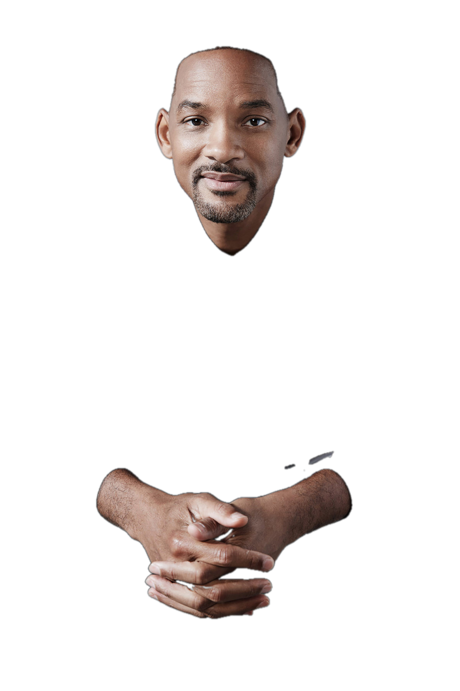

# Skin Segmentation

This repository details the various methods I have attempted for skin segmentation.

## Traditional

There are two methods in this folder that are doing roughly the same thing.

The first is in [hsv_range.py](traditional/hsv_range.py). This gives the user an interface to adjust various thresholds to make a more accurate mask of the skin in an image.

The second is in [face_skin.py](traditional/face_skin.py). It detects the face in an image and automatically adjusts the thresholds based upon the data in that area.

Neither method was accurate enough for me. They are good if you need something fast and possibly in the ballpark. I even attempted to use both HSV color ranges and YCbCr ranges to no avail. Therefore, I went to the next part.

## Google

This is a very basic implementation of skin segmentation utilizing Google's MediaPipe model. A list of models can be found [here](https://developers.google.com/mediapipe/solutions/vision/image_segmenter#selfie-model), but I used the Selfie segmentation model. 

It worked ok when it did work. Often, the prediction would have extremely low confidence across an entire image. 

Therefore, I decided to pursue making a model of my own.

## U2-Net

As a preface, I did not originally start with this model architecture. I originally planned on making my own, but failed in a lot of different ways. Let's just say I know a few architectures that will take 12 GB of VRAM to train at a batch size of 1 and produce almost artistic representations of the input data. 

So, after weeks of research, I settled on the [U2-Net](https://github.com/xuebinqin/U-2-Net) architecture. I recommend checking out the original repo, plus the paper is a good read. It seemed to perform well in [rembg](https://github.com/danielgatis/rembg) with the added benefit of inferencing code (to an extent). 

Off I set to create a dataset of training images. It took a few weeks, maybe a month, but I had my dataset. I used [rembg-trainer](https://github.com/Jonathunky/rembg-trainer) initially, but my limited compute meant the code did not work well on my system. Lots of changes later and I had functioning code, a dataset, and a GPU to train it on. 

A few weeks of figuring out training further and I ended up with a few models. They are refined to the following input resolutions: 320x320, 512x512, and 1024x1024. Probably the best to use of these is the 512x512 model as it is a good balance of memory and the fit of the model.

### Examples

<!-- I claim no rights to the original images -->

As you can see, it's not perfect. But it's rather usable. These were also using the 1024x1024 model. The 512x512 model tends to not be confident about things that are not skin, so it produces more accurate but less precise results. 

I'm not sure why, but the model seems to have a vendetta against Barack Obama and does not do well with him. I'm unsure what is going on there. 

